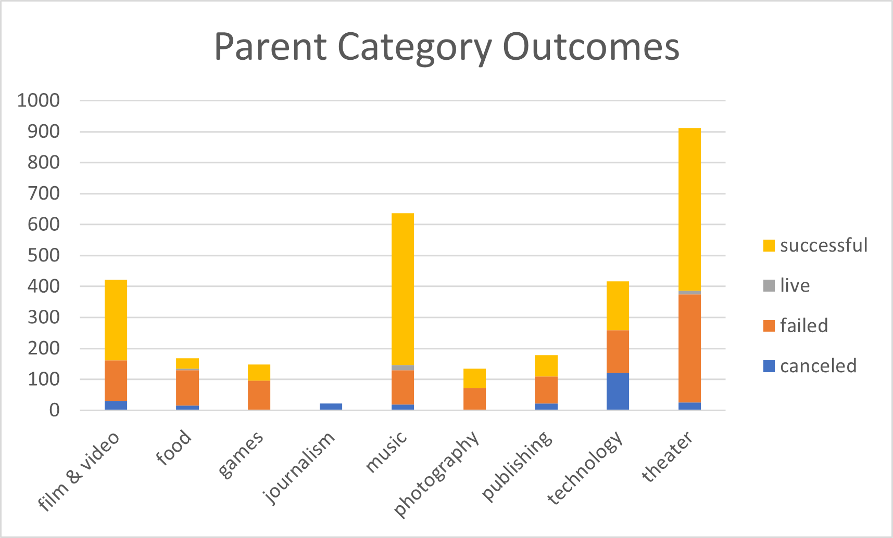
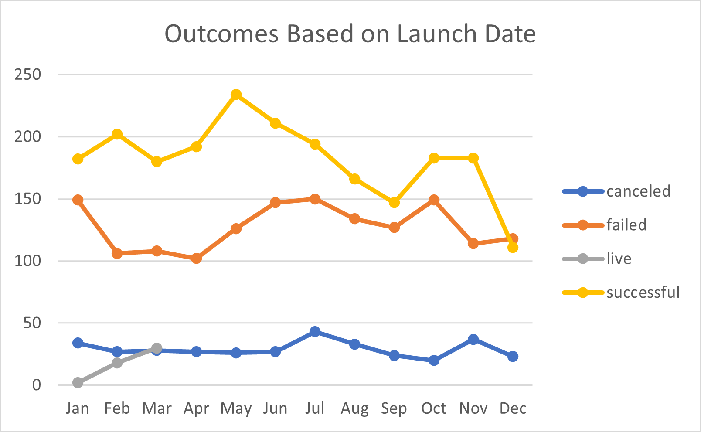
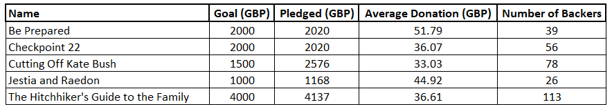
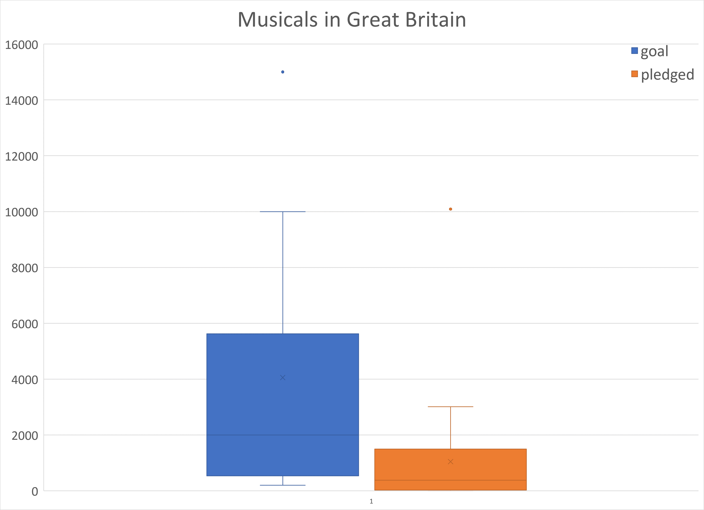

# An Analysis of Kickstarter Campaigns

This analysis investigates Kickstarter campaigns as a method to generate theater production capital. The purpose of the analysis is to provide understanding and insight for the client, an aspiring playwrite named Louise. The client has interest in crowdfunding a play in the US with an estimated budget of over $10,000 as well as a musical in Great Britain with an estimated budget of £4000. These scenarios are the bases for this analysis.

Crowdfunding data over a multi-year span from 2009-2017 was analyzed to assist in crowdfunding plans for your proposed play, *Frenzy*, with a budget of over $10,000. A total of 3038 campaigns conducted in the US and covering multiple categories were analyzed. Of those 3038 campaigns, roughly 30%, or 912, were specifically theater related campaigns as indicated in Figure 1. Furthermore, roughly 20%, or 671, of the total US campaigns were specifically for plays. Of the US crowdfunding data analyzed, theater related campaigns are quite popular.

*Figure 1. Kickstarter Outcomes by Parent Category*

The data reveals that roughly 61% of the crowdfunding campaigns for US plays were successful with mean and median fund-raising goals of $5,049 and $3,000, respectively, and a standard deviation of $7,749. Furthermore, 75% of successful play campaigns had fund-raising goals less than $5,000. Successful play campaigns averaged an amount pledged of $5,602 while the median amount pledged was $3,168. 

The failed crowdfunding campaigns for plays had mean and median fund-raising goals of $10,554 and $5000, respectively, with a standard deviation of $21,968. Additionally, 75% of the failed campaigns set their fund-raising goals below $10,000. Failed play campaigns generally fell well short of their fund-raising goals with mean and median pledged amounts of $559 and $103, respectively.

In addition to the goal amount, the timing of the launch date may also be related to the success of the campaign. As Figure 2 indicates, the number of successful launches was generally highest in the months January – July with a peak in May.

*Figure 2. Kickstarter Outcomes by Launch Date*

The client expressed interest in Great Britain’s theater market, specifically requesting information on five plays you saw at the Edinburgh Festival Fringe. The data shows that all five plays were successfully crowdfunded. The funding amounts ranged from roughly £1200 for Jestia and Raedon to over £4000 for The Hitchhiker’s Guide to the Family. The number of backers ranged from 26 to 113, and the average donation ranged from approximately £33 to £52. This data is summarized in Figure 3.

*Figure 3. Summary Data for Edinburgh Plays*

The client also expressed interest in Great Britain musicals for future work. Box plots are included below to give an idea of the market. The box plots show that the mean and median goals are roughly £4,000 and £2,000, respectively, and 75% of the goals are under £6,000. In contrast, the mean pledge is around £1,000, and the median pledge is well under £1,000. Furthermore, 75% of pledges are under £2,000, and 25% received no pledge.

*Figure 4. Goal and Pledge Box Plots for Musicals in Great Britain*

Based on this data, it is recommended that the client lower the fund-raising goal for *Frenzy* or seek other means of production capital. On average, failed play campaigns sought $10,554 which is just over the client's expectated budget of $10,000. If the client does decide to crowdfund your production, it would be advisable to launch the campaign early in the year; ideally in May.

With regard to a future musical in Great Britain, crowdfunding may not be the best option. A budget of £4,000 falls close to the average crowdfunding goal, but based on the pledge amounts, it is unlikely that this goal would be met. 

