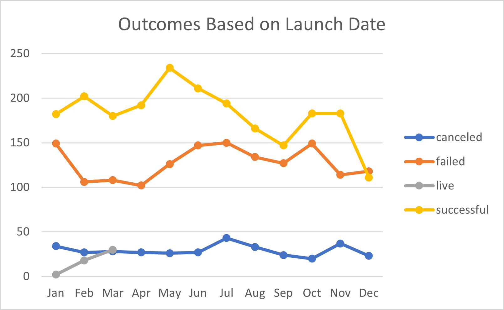

# Kickstarting with Excel

## Overview of Project

In this project, Kickstarter data was used to assist an aspiring playwrite, Louise, in her crowdfunding efforts for an upcoming play in the US with a budget of more than $10,000 and a possible musical in Great Britain with a budget of £4,000. Kickstarter data for more than 4,000 campaigns in various categories was analyzed to gain insight into the campaign success rate based on a number of factors including goal amounts, launch date, category, location, etc. In order to assist Louise in crowdfunding efforts, data was specifically investigated for theater-related categories with a specific emphasis on plays. Microsoft Excel was used to filter, sort, and analyze data using formulas and built-in Excel functions. Pivot tables and charts were also used to visualize data relevant to the Louise's questions.

For this week's challenge, it is assumed that the client quickly came close to reaching her fundraising goal. Now the client wants to understand any relationships between campaigns and their launch dates and funding goals. Therefore, this portion of the project analyzes theater-related campaigns versus their launch date as well as play campaigns versus their funding goals.

### Purpose

The overall purpose of this project was to use Microsoft Excel to gain insight into crowdfunding as a means of acquiring production capital for theater-related productions, specifically plays. Students improved their Excel skills while performing analysis to assist an aspiring playwrite in her crowdfunding decision making and understanding.

## Analysis and Challenges

The analysis performed for this challenge built on the foundation established during the weekly assignment. In the weekly assignment, analysis was performed to assist the client in her crowdfunding decision by analyzing data from Kickstarter that included campaigns from 2009-2017. The client wanted to crowdfund a play, *Frenzy*, in the US with a budget of more than $10,000, and she had questions about a potential musical in Great Britain with an estimated budget of £4,000. To assist the client in her decision and understanding of crowdfunding for theater productions, analysis was performed to investigate campaign outcomes by campaign category as well as launch date. A dataset containing Kickstarter data was supplied and analyzed using various Excel functionality such as filtering, freezing panes, conditional formatting, and built-in Excel functions.

Pivot tables and pivot charts were used to investigate and visualize Kickstarter US campaign outcomes by category as well as all campaign outcomes versus launch date. A stacked bar chart of campaign outcomes by launch date is shown in Fig. 1.

*Figure 1. Kickstarter outcomes by parent category*

It is clear from Fig. 1 that theater campaigns were popular in the US over the timeframe encompassed by the data. In fact, 971 (roughly 30%) of the total campaigns in the US were spefically theater-related campaigns.

In addition to the goal amount, the timing of the launch could also impact the success of a campaign. The line chart in Fig. 2 investigates the outcome versus launch date for all campaigns domestically and internationally. The chart suggests that there may indeed be a seasonality associated with Kickstarter campaigns as those launched earlier in the year experienced greater success with a peak in the month of May.

*Figure 2. Kickstarter outcomes by launch date*

Measures of central tendency (mean and median) and measures of spread (standard deviation, lower quartile (Q1), upper quartile (Q3), and inner quartile range (IQR)) were also investigated for successful and failed play campaigns in the US. The data reveals that roughly 61% of the crowdfunding campaigns for US plays were successful with mean and median fund-raising goals of $5,049 and $3,000, respectively, and a standard deviation of $7,749. Furthermore, 75% of successful play campaigns had fund-raising goals less than $5,000. Successful play campaigns averaged an amount pledged of $5,602 while the median amount pledged was $3,168.

The failed crowdfunding campaigns for plays had mean and median fund-raising goals of $10,554 and $5000, respectively, with a standard deviation of $21,968. Additionally, 75% of the failed campaigns set their fund-raising goals below $10,000. Failed play campaigns generally fell well short of their fund-raising goals with mean and median pledged amounts of $559 and $103, respectively. These results are summarized in Fig. 3.

*Figure 3. Descriptive statistics for successful and failed play campaigns in the US*

The client also wanted to know if five specific Great Britain plays were crowdfunded. The VLOOKUP() function in Excel was used to find that the five plays were indeed successfully crowdfunded, and this data is presented in Fig. 4.

*Figure 4. Summary data for Edinburgh plays*

The client also expressed interest in Great Britain musicals for future work. Box plots are shown in Fig. 5 to give an idea of the market. The box plots show that the mean and median goals are roughly £4,000 and £2,000, respectively, and 75% of the goals are under £6,000. In contrast, the mean pledge is around £1,000, and the median pledge is well under £1,000. Furthermore, 75% of pledges are under £2,000, and 25% received no pledge.

*Figure 5. Box plots for musical campaigns in Great Britain*

Following this analysis, the client launched her campaign for *Frenzy* in the US, and quickly came close to her fundraising goal. As a result of her campaign success for *Frenzy*, the client wanted to understand the specific relationship between the outcome of theater campaigns and launch date as well as the outcome of play campaigns versus their fundraising goals.

### Analysis of Outcomes Based on Launch Date

To investigate the specific relationship between theater campaigns and launch, a pivot table was created to investigate the relationship between launch date and the outcome of theater campaigns. The pivot table was filtered on parent category and years with the outcomes as columns, the launch date as rows, and the count of outcomes as the values. The parent category was set to filter on theater campaigns, and the pivot table columns were sorted in descending order to show successful results as the first results column.

For the data included in this analysis, theater campaigns launched in the months of May-July generally experienced higher rates of success compared to campaigns launched during other months of the year as shown in Fig. 6.

*Figure 6. Theater outcomes based on launch date*

Specifically, theater campaigns launhced in May experienced the highest success rate with 166 campaigns launched and 111 resulting in success. A relatively linear decrease in success rate was observed from May through the month of September. The number of failed and canceled campaigns remained relatively flat throughout the year indicating that the larger number of successful campaigns observed in May-July were not simply the result of more campaigns launched in those months. Therefore, there does appear to be a seasonality associated with the success of theater crowdfunding campaigns.

### Analysis of Outcomes Based on Goals

As a result of the client's success in her own campaign, she also wanted to see the trend for play campaign outcomes based on the fundraising goal. To provide this information, a new worksheet was created that grouped the campaigns by funding goal ranges to show the number of successful, failed, and canceled campaigns based on various funding goal levels. The COUNTIFS() function was used in excel with criteria set to limit the count to plays that were either successful, failed, or canceled with specific funding goal amounts. An example of the COUNTIFS() function to find the number of successful plays with funding goals in the range of $20,000-$24,999 is shown in Fig. 7. Note that the formula as implemented to work with the categories in Fig. 7 effectively rounds each goal amount down to the nearest dollar. In other words, a funding goal of $4999.95 would fall into the '$1000 to $4999' category for the purposes of this analysis.

*Figure 7. Example COUNTIFS() function in Excel*

The results of this analysis are plotted in Fig. 8 using a line chart to show three different lines. One line represents successful campaigns, one line represents failed campaigns, and one line represents canceled campaigns.

*Figure 8. Theater outcomes based on launch date*

For funding goals from less than $1000 to $14,999 and from $35,000-$44,999, succesful campaigns outnumbered failed campaigns. The highest success rates occured for funding goals of $4,999 or less, and the highest failure rates occured for funding goals of $30,000-$34,999 and $45,000 or greater. There were no successful campaigns with funding goals in the $45,000-$49,999 range, and only 2 campaigns (or 13%) were succesful with funding goals greater than $50,000. With respect to Fig. 6, it is interesting to note the reversal in the percentage of successful campaigns for funding goals from $35,000-$44,999. More analysis is needed to determine if there are other factors contributing to the success rate in this funding goal range such as type of play, seasonality, etc. It is also interesting to note that there were no canceled play campaigns in the dataset.

### Challenges and Difficulties Encountered

There were no challenges or difficulties encountered in this challenge. The exercises leading up to the challenge were excellent preparation. However, if one was not familiar with excel, there could certainly be difficulties with the formatting for the various functions used in the module as well as in the challenge. It could also be difficult to discern which quantities to place in which fields for the pivot tables. Fortunately, the pivot table gives immediate feedback making it easy to exeriment with different setups.

## Results

- What are two conclusions you can draw about the Outcomes based on Launch Date?
    1. Referring to Fig. 6 and comparing the number of successful campaigns to the number of failed and canceled campaigns, those launched in the months of May-July had a higher success rate than those launched at other times in the year. Specifically, the highest success rate occured in campaigns launched in May with a relatively linear decrease in success rate through September. Furthermore, the success rate of campaigns decreases later in the year with a poor success rate in the month of December.
    2. The number of failed and canceled campaigns remained relatively flat throughout the year. This indicates that proportionally more successful campaigns were launched in the months of May-July and implies that there may be a seasonality involved in the success of theater campaigns.

- What can you conclude about the Outcomes based on Goals?
    - In general, lower goal amounts appear to have higher likelihoods of success with funding goals of less than $1,000 and $1000-$4,999 achieving success rates of 76% and 73%, respectively. Additionally, funding goal amounts greater than $45,000 showed very low success rates. However, there was a funding goal region from $35,000-$44,999 where the success rate exceeded the failure rate. It is unclear if there were additional factors contributing to this reversal from the surrounding data, and further analysis is required.

- What are some limitations of this dataset?
    - This dataset only looks at data from Kickstarter without considering other sources of crowdfunding. It is possible that other crowdfunding platforms have different results for theater-related productions.
    - This data does not consider data from 2018-present. It is possible that crowdfunding data has changed over this period of time and should be considered in the analysis.

- What are some other possible tables and/or graphs that we could create?
    - A pie chart could be used to illustrate the theater outcomes by launch date. For example, all successful campaigns could be shown in a pie chart where each slice represents a month. The same could be done for failed campaigns and canceled campaigns.
    - The success rate, or percentage of successful campaigns, could also be calcuated on a per-month basis. This data could be displayed in a line chart or a bar graph.
    - Histograms could be used to show a distribution of the number of successful, failed, or canceled campaigns based on the ranges of funding goals that were examined for deliverable 2.